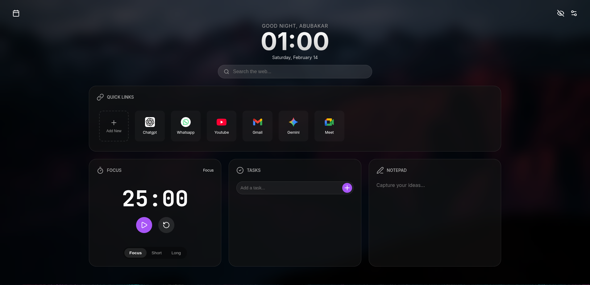
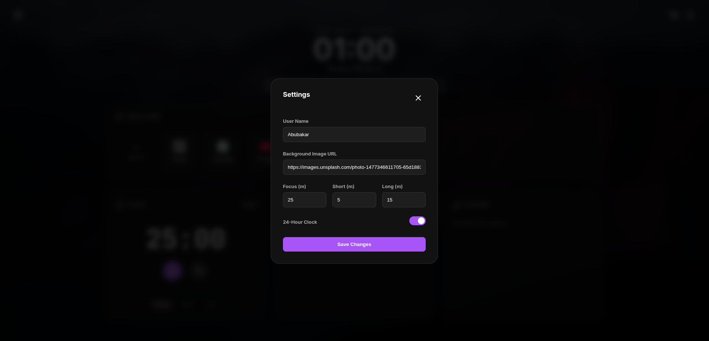
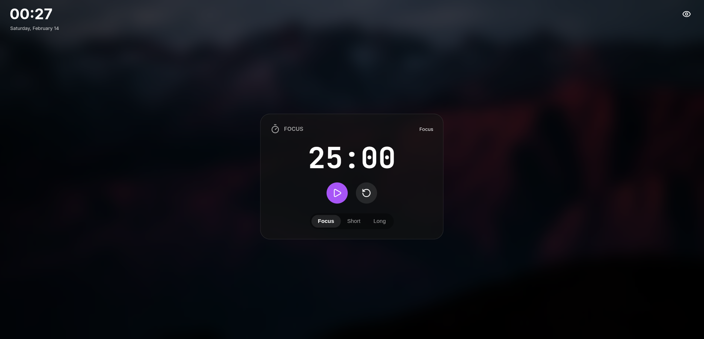
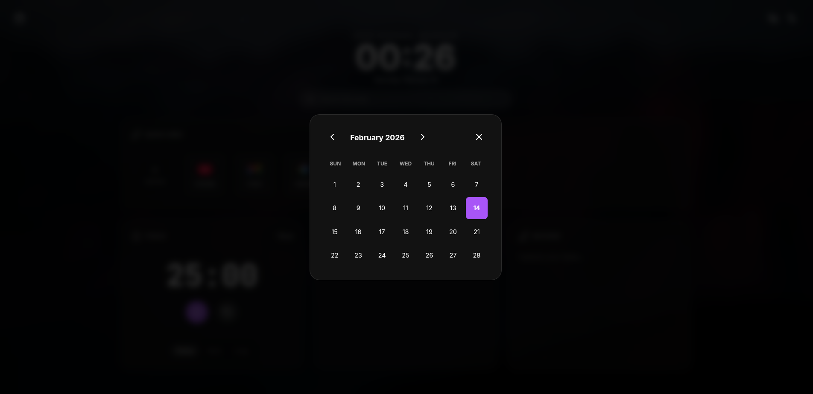

# Zen Tab 🧘‍♂️

Zen Tab is a beautiful, minimalist, and highly customizable browser "New Tab" extension designed to help you stay focused and productive. It replaces your default start page with a sleek dashboard featuring essential tools in a clean bento-grid layout.



## ✨ Features

- **Dynamic Greetings:** Personalized greetings that change based on the time of day (Morning, Afternoon, Evening, Night).
- **Customizable Clock:** Toggle between 12-hour and 24-hour formats with a smooth animated switch.
- **Focus Mode:** A dedicated mode that hides all widgets and distractions, leaving only the clock and a large timer to help you stay in the zone.
- **Pomodoro Timer:** Built-in focus timer with customizable Focus, Short Break, and Long Break intervals.
- **Quick Links:** A sortable, drag-and-drop grid for your favorite websites. Easily add, edit, or delete links.
- **Task Management:** A simple, integrated todo list to track your daily goals.
- **Notepad:** A quick-access scratchpad for capturing thoughts and ideas that persists across sessions.
- **Interactive Calendar:** A beautiful monthly calendar widget.
- **Custom Backgrounds:** Set any Unsplash image or custom URL as your background to match your aesthetic.

## 🚀 How to Use

### 1. Personalization
Click the **Settings** icon (gear) in the top right to:
- Change your display name.
- Set a custom background image URL.
- Adjust Pomodoro timer lengths.
- Toggle between 12h and 24h clock formats.



### 2. Staying Focused
- Click the **Eye Icon** in the top right to enter **Focus Mode**. This scales the timer and removes all other clutter.
- Use the **Timer** widget to start a Pomodoro session.



### 3. Managing Links & Tasks
- **Add Link:** Click the "Add New" card in the Quick Links section. You can drag and drop cards to reorder them.
- **Tasks:** Type your task in the input box and press Enter or click the "+" button. Click a task to mark it as complete.

### 4. Calendar
- Click the **Calendar Icon** in the top left to view the full monthly calendar.



## 📥 Manual Installation (Chrome/Brave/Edge)

As Zen Tab is not currently on the Chrome Web Store, you can install it manually by following these steps:

1. **Build the extension:** (If you haven't already)
   ```bash
   npm install
   npm run build
   ```
2. Open your browser and go to `chrome://extensions` (or `edge://extensions` for Edge).
3. Enable **Developer mode** (usually a toggle in the top right).
4. Click **Load unpacked**.
5. Select the `dist` folder located in the project's root directory.
6. Open a new tab to see Zen Tab in action!

## 🛠 Installation / Development

This project is built with **Vite** and uses **Lucide Icons** and **SortableJS**.

### Prerequisites
- [Node.js](https://nodejs.org/) (v16 or higher)
- [npm](https://www.npmjs.com/)

### Setup
1. Clone the repository.
2. Install dependencies:
   ```bash
   npm install
   ```
3. Run in development mode:
   ```bash
   npm run dev
   ```
4. Build for production (output will be in the `dist` folder):
   ```bash
   npm run build
   ```

## 📜 License
ISC License
